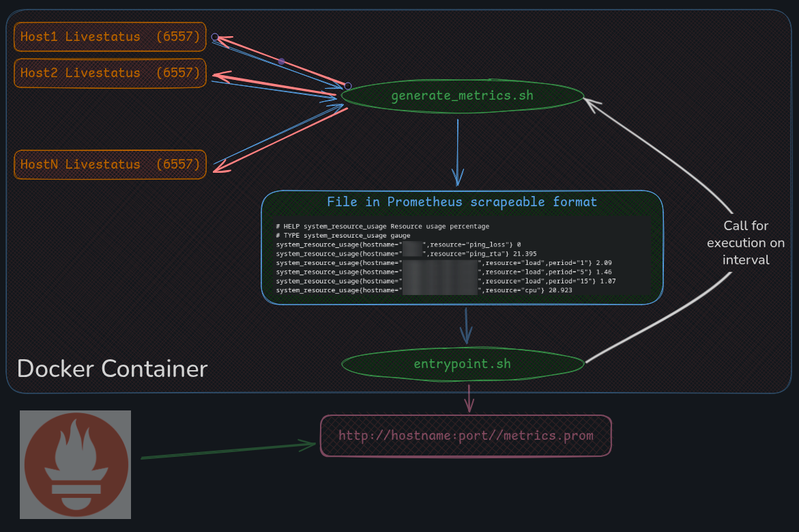
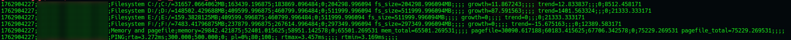
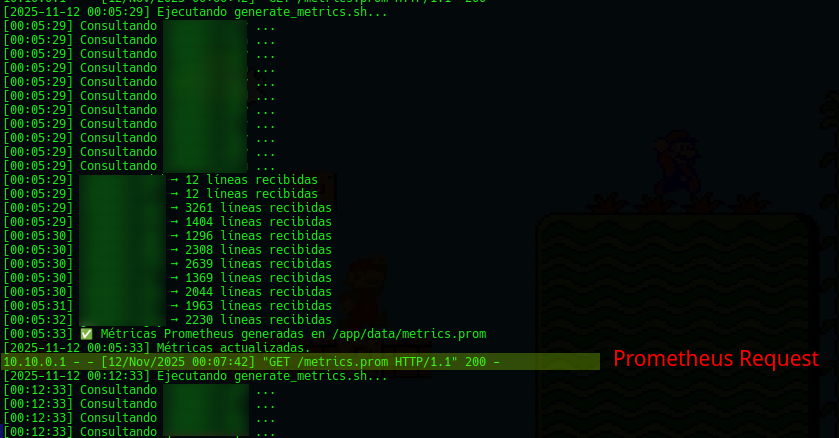

# livestatus_to_prometheus_exporter


A lightweight Prometheus exporter for Check_MK / Livestatus metrics.  
It collects CPU (load and utilization), Memory, Filesystems, and PING metrics and exposes them for Prometheus scraping.  
The exporter is extensible via the AWK section and the Livestatus query.



---

## Get Started
```bash
# Clone the repository
git clone https://github.com/martinmartossimon/livestatus_to_prometheus_exporter
cd livestatus_to_prometheus_exporter

# Customize your environment
cp .env.example .env
# Edit .env as needed

# Launch the Docker container
docker run -d --rm --name livestatus-metrics \
    --env-file .env \
    -v $(pwd)/data:/app/data \
    -p 9501:9100 livestatus-metrics

# Validate metrics endpoint
curl http://hostname:9501/metrics.prom

```

---

## Build & Run with Custom Options
```bash
# Build Docker image
docker build -t livestatus-metrics .

# Run interactively for testing/debugging
docker run -it --rm --name livestatus-metrics \
    --env-file .env \
    -v $(pwd)/data:/app/data \
    -p 9501:9100 livestatus-metrics

# Run detached
docker run -d --rm --name livestatus-metrics \
    --env-file .env \
    -v $(pwd)/data:/app/data \
    -p 9501:9100 livestatus-metrics

# Follow logs in real-time
docker logs -f livestatus-metrics
```

## Prometheus Configuration Example
Edit as needed for your environment:
```yml
global:
  scrape_interval: 15s
  scrape_timeout: 10s


scrape_configs:
  - job_name: 'livestatus-metrics'
    scrape_interval: 7m # Customize as you need
    static_configs:
      - targets:
          - 'hostname:port'   # Customize as you need
    metrics_path: /metrics.prom

```


## Verification & Logs
```bash
# Verify metrics endpoint
curl http://hostname:9501/metrics.prom

# Follow logs
docker logs -f livestatus-metrics
```
